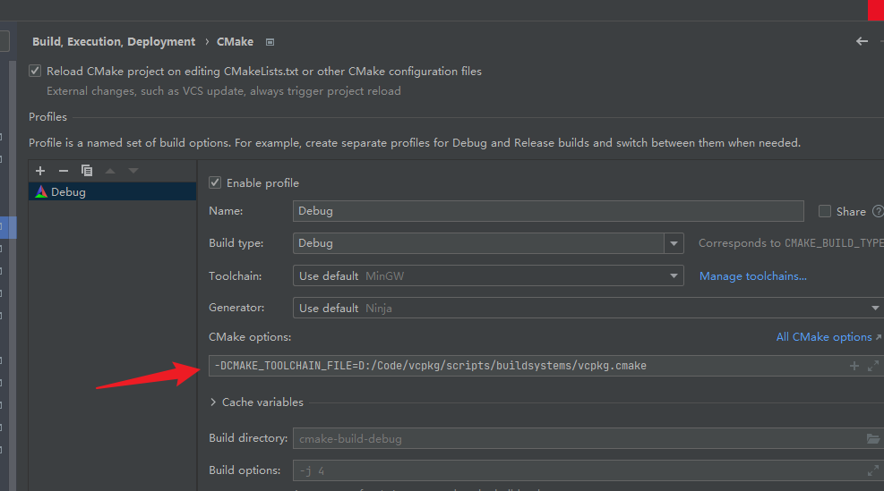

```
  git clone https://github.com/Microsoft/vcpkg.git
  cd vcpkg
  bootstrap-vcpkg.bat
  vcpkg integrate install
  vcpkg install raylib
```




```
// CMakeLists.txt
find_package(raylib CONFIG REQUIRED)
target_link_libraries(iRay PRIVATE raylib)
```